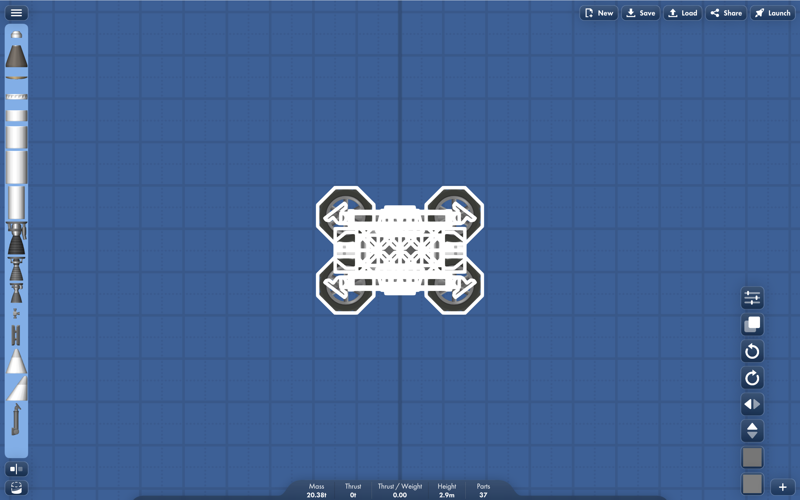
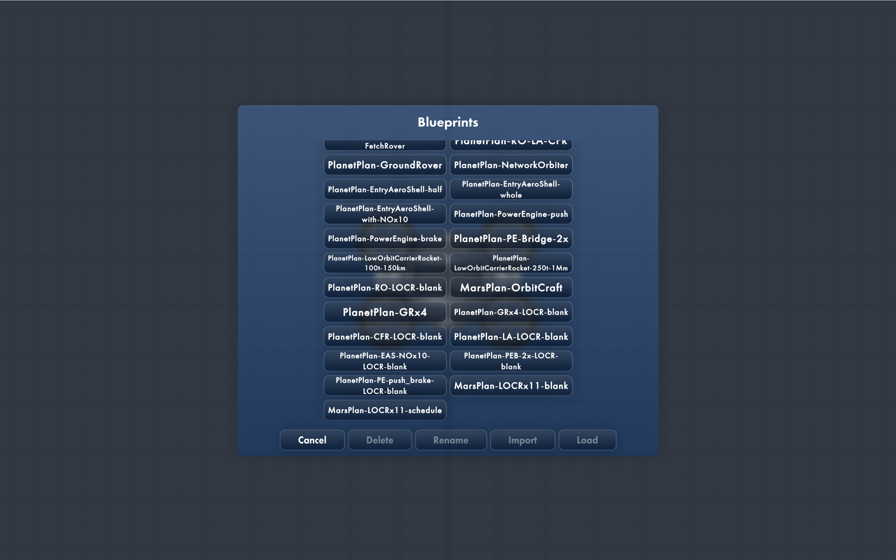
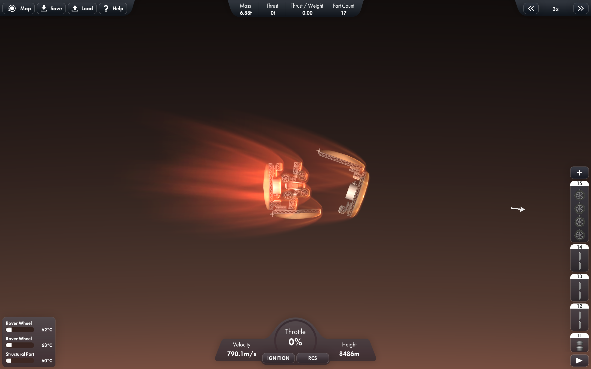

# SFS-Blueprints
- ゲーム『Spaceflight Simulator』の利用可能なブループリント集です。
- SFS **ファン**によって作成されました。
- すべてのブループリントは SFS を愛するすべての人に**無料**で共有されます。

[English(US)](./README_en-US.md)
[English(UK)](./README_en-GB.md)
[简体中文](./README_zh-CN.md)
[繁体中文](./README_zh-TW.md)
[日本語](./README_ja-JP.md)

---

### はじめに

- ここで素晴らしいブループリントを手に入れることができます。  
  
- ブループリントのより多くのTipsを学ぶことができます。  
  
- 自分や他人が作ったお気に入りのブループリントをここで共有できます。  
  
- ブループリントの改善のためのフィードバックを提供できます。  
  
- 気に入ったブループリントをダウンロードして、SFS で楽しもう！  
  

---

### MIT ライセンス
[LICENSE](./LICENSE)
> **MIT ライセンス** とは、著作権表示とライセンス表示を保持する限り、誰でも本ソフトウェアを使用、コピー、変更、マージ、公開、配布、サブライセンス、販売できることを意味します。

---

### 命名規則
- フォルダ：**[GameVersion]**
- サブフォルダ/ファイル名：**[BlueprintName]-[BlueprintFunction]-[BlueprintVersion]-[BlueprintAuthor]**
> - **必須**：*BlueprintName*  
> - **任意**：*BlueprintFunction*、*BlueprintVersion*、*BlueprintAuthor*  
> - 1つのフォルダ内に複数のブループリントを置くことができます。  
> - 更新時は古いバージョンを上書きせず、新しい *BlueprintVersion* で新バージョンを作成してください。  
> - サブフォルダ内に *README.md* を追加してブループリントを紹介できます。  
> - 詳細やデモ画像は `/.picture/` サブフォルダに保存してください。

---

### 注意事項
- ゲームバージョンがわずかに異なる場合、ブループリントはクロスプラットフォームで互換性があります。  
- **1.5.x.x** のブループリントは通常 **1.6.x.x** で動作しますが、**1.6.x.x** のものは **1.5.x.x** で読み込めないことが多いです。  
- PC版は通常 `Blueprint.txt` と `Version.txt` を含むフォルダです。Android版は単一ファイルです。プラットフォーム間で使用する際はファイル名を変更してください。

---

### 友好リンク
- [**SFS-Extensions** GitHub（翻訳・MOD・太陽系）](https://github.com/...)  
- [QQグループに参加する](404.md)  
- [**あなたのリンクをここに追加**](./.forgithub/docs/AddFriendlyLink.md)

---

### その他
- [***Steam*** で『Spaceflight Simulator』をダウンロード](https://store.steampowered.com/app/1718870/Spaceflight_Simulator)  
- [初心者向けスタートガイド]()  
- [ブループリントのインポート方法]()  
- [***SFS Universe*** でさらに多くのブループリントとMODを見る](https://sfsuniverse.com/)  
- [ブループリントを一括ダウンロードする方法](./DOWNLOADING.md)  
- [新しいブループリントを**貢献**する方法](./CONTRIBUTING.md)

---

### このリポジトリについて
- [このリポジトリの**整理を手伝ってください**](./.forgithub/docs/HelpToTidy.md)  
- [**異なるプラットフォーム**のバージョン情報を貢献する](./.forgithub/docs/ContributeDifferentPlatformsInfo.md)  
- [**参加してリポジトリを更新しよう**](./.forgithub/docs/JoinUs.md)  
- [**README.md などの翻訳を提供する**](./.forgithub/docs/ProvideTranslations.md)
